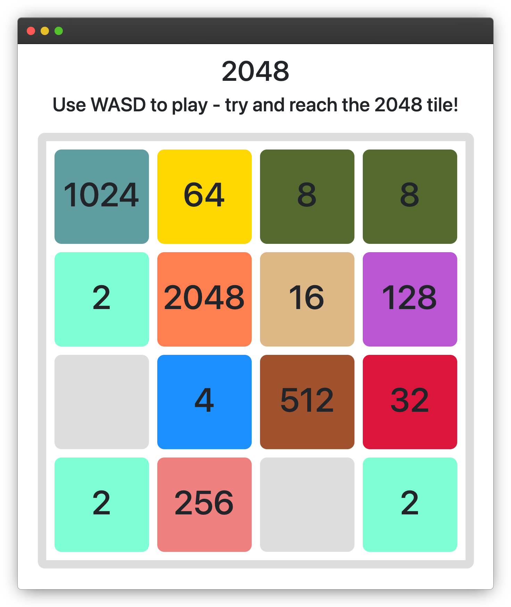

# 2048 Game Clone
#### Video Demo:  <URL HERE>
#### Description: This is a clone of the game [2048](2048game.com).

## What is 2048?
2048 is a tile-based game where you merge tiles together to try and reach the 2048 tile. Using the WASD keys, you can slide tiles in all directions around the grid. Each time you move the tiles, a new tile is generated. When two tiles with the same number collide, they merge together to form a tile that has a value of the sum of the two tiles that merged. Once a tile with the value 2048 is reached, you win the game. However, you may reach a situation where the grid is full and no tiles can merge. This means game over because you have no more remaining moves.
## Creating the Game
For the game, I decided to use a simple Flask backend, but most of the game code is run on the client side.
#### File structure
In the project, you'll find a `templates` directory, a `static` directory, and an `application.py` file.
#### `application.py`
In the file `application.py` is the code for a simple web server, as well as one route since this is a single-page web-app.
#### `static`
The `static` directory is where all the project's assests are located. You'll notice a CSS file for the styling, as well as a JavaScript file which contains most of the code to control the game.
#### `templates`
The `templates` directory contains the HTML file for the web-app. You'll notice that there isn't to much HTML, since the game board is procedurally generated using JavaScript. In addition, I also link in some basic Bootstrap to provide a little extra styling to the web-app.
## Running the program
In order to run 2048, clone this repository and use `flask run` to run it from the command line.
## How it all works
Most of the game code is located in `static/index.js`, so take a look in there to see the code.
#### Functions
Most of the code is located in 8 main functions:
- `animRight()`
- `moveRight()`
- `animLeft()`
- `moveLeft()`
- `animDown()`
- `moveDown()`
- `animUp()`
- `moveUp()`

The functions prepended with `anim` contain the animation code for tiles on a given access. For example, `animRight()` is the animation for a tiles to move right.

The animations work by using `setInterval()` to adjust positions of elements. For each tile on the board, a new placeholder tile is generated over the tile. The placeholder tile has an absolute position, so `setInterval()` can iteratively adjust its `left`, `right`, `top`, and `bottom` properties to give the impression of movement. The placeholder tile is then removed after the animation.

This process happens in all animation functions, albeit on different axis.

On the other hand, all functions prepended with `move` are used to calculate the position a tile should move to, determine if the tile needs to merge with another tile, and then call the respective animation function to move the tile.

At the bottom of the file is an event listener that listens for keypresses, and then calls different `move` functions based on what key is pressed.

In addition, the code contains a few extra functions:
- `generateBoard()` - This functino is used to procedurally generate the board once the page is loaded.
- `boardFull()` - This function is used to detect if the board is full of tiles, so the program doesn't induce an infinite loop when generating new tiles.
- `generateTile()` - This function generates a new tile every turn by picking a random spot on the grid.
- `checkWinLoss()` - This function checks to see if the user has won or lost the game